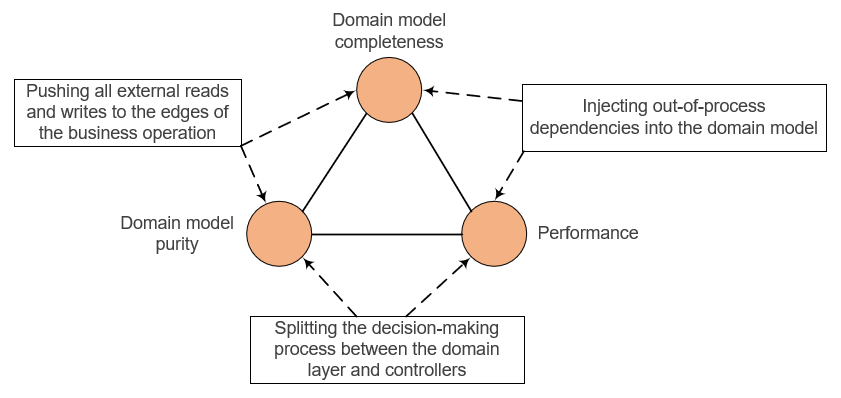

# 아키텍처 트릴레마(Trilemma)
- 캡슐화: Domain model completeness
- 순수성: Domain model purity
- 성능: Performance

- **캡슐화 & 순수성**: Push all external reads and writes to the edges of a business operation.
- **캡슐화 & 성능**: Inject out-of-process dependencies into the domain model 
- **순수성 & 성능**: Split the decision-making process between the domain layer and controllers