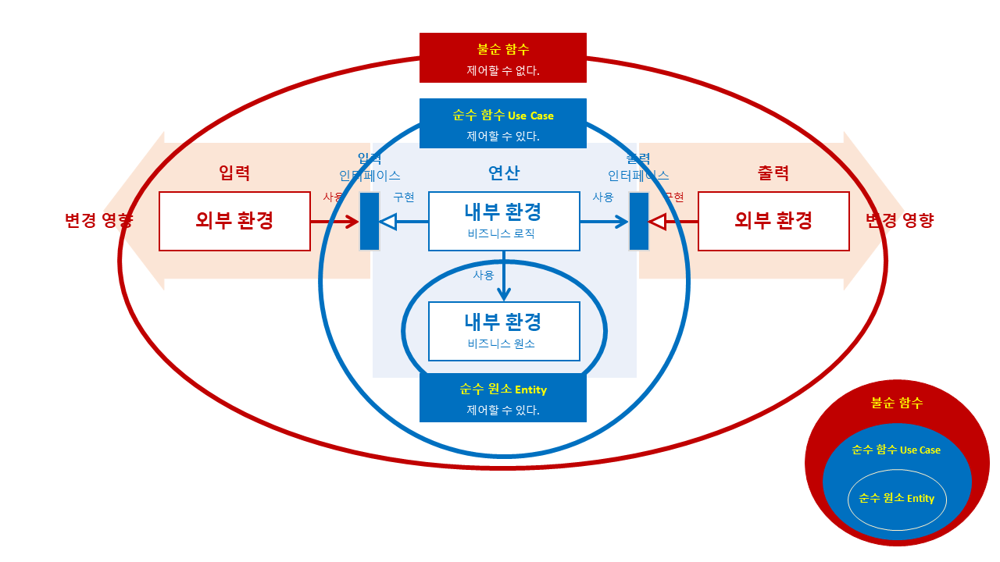
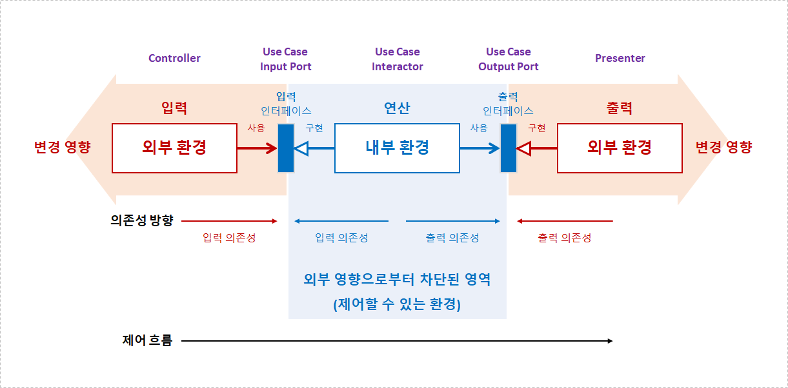
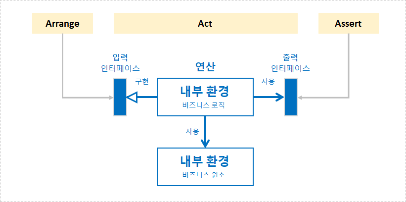

# 아키텍처

> 소프트웨어 아키텍처는 **유스 케이스가 중심이다.**



## 목차
- 아키텍처 필요성
- 아키텍처 정의
- 아키텍처 원칙
- 아키텍처 역사
- 아키텍처 레이어
- 아키텍처 의존성과 제어 흐름
- 아키텍처 문서화
- 아키텍처 테스트
- 아키텍처 트릴레마(Trilemma)
- 요약
- 참고 자료

<br/>

## 아키텍처 필요성


- 출처: [Is High Quality Software Worth the Cost?](https://martinfowler.com/articles/is-quality-worth-cost.html)

<br/>

## 아키텍처 정의
> 프로젝트에 참여하는 **개발자들이 설계**에 대해 공유하는 이해를 반영하는 **주관적인 개념**

- 출처: [애플리케이션 아키텍처와 객체지향](https://www.youtube.com/watch?v=26S4VFUWlJM)

중요한 것  
변경하기 어려운 것  
일찍, 올바르게 결정하는 것
- 예. 코드 배치를 어떻게 할 것인가?

<br/>

## 아키텍처 원칙


> **관심사의 분리(Separation of Concerns)**

- 서로 다르고 관련이 없는 책임(Responsibility)들을 분리한다.
  - 예. 레이어

<br/>

## 아키텍처 역사
- 레이어(관심사의 분리) 배치 역사다.


### 도메인 주도 설계(Domain-Driven Design) 이전/이후 의존성


<br/>

## 아키텍처 레이어
- 외부 환경(비결정적 환경, 불순 함수): 비즈니스 기능 중심
  - **※ 제어할 수 없는 환경**
    - 예. 시간
    - 예. 화면
    - 예. 파일 시스템
    - 예. 네트워크: gRPC, HTTP API, FTP, ...
    - 예. ...
- 내부 환경(결정적 환경, 순수 함수): 비즈니스 로직 중심
  - **※ 제어할 수 있는 환경**

<br/>

## 아키텍처 의존성과 제어 흐름

- 연산 입/출력


- 연산 입/출력 제어 흐름


- 연산 입/출력 의존성 방향


- 출력 변경 영향


- 연산 변경 영향


- 출력 변경 영향 전파


- 연산과 출력 분리


- 연산과 입력 분리


- 연산과 입/출력 분리


- 아키텍처 용어


- 아키텍처 구조


- 내부(제어할 수 있는) 환경 레이어 세분화
  - **비즈니스 로직**: 유스 케이스  
    ※ **소프트웨 아키텍처는 유스 케이스가 중심이다.**  
    ※ The architecture should scream the intent of the system!
  - **비즈니스 원소**: 비즈니스 최소 단위


<br/>

## 아키텍처 문서화
- 외부 환경(제어할 수 없는): 비즈니스 기능 중심
- 내부 환경(제어할 수 있는): 비즈니스 로직 중심

<br/>

## 아키텍처 테스트
- 의존성
- 관계
- 네이밍 컨벤션
  ```cs
  [Fact]
  public void DomainEventNames_ShouldEndWithDomainEvent()
  {
  	// Arrange
  	var assembly = Shopway.Application.AssemblyReference.Assembly;

  	// Act
  	var result = Types
  		.InAssembly(assembly)
  		.That()
  		.ImplementInterface(typeof(IDomainEvent))
  		.Should()
  		.HaveNameEndingWith(DomainEvent)
  		.GetResult();

  	// Assert
  	result.IsSuccessful.Should().BeTrue();
  }
  ```
- ...

### 내부 환경 테스트
- 단위 테스트: **유스 케이스**를 테스트한다.



### 외부 환경 테스트
- 통합 테스트: 시스템과 통합된 **유스 케이스**를 테스트한다.


- End to End 테스트: 전체 시스템과 통합된 **유스 케이스**를 테스트한다.


<br/>

## 아키텍처 트릴레마(Trilemma)
- 캡슐화: Domain model completeness
- 순수성: Domain model purity
- 성능: Performance


- **캡슐화 & 순수성**: Push all external reads and writes to the edges of a business operation.
- **캡슐화 & 성능**: Inject out-of-process dependencies into the domain model 
- **순수성 & 성능**: Split the decision-making process between the domain layer and controllers

<br/>

## 요약
### WHAT
- 소리치는 아키텍처
  - 소프트웨어 아키텍처는 유스 케이스가 중심이다.
- 테스트
  - 내부 환경
    - 단위 테스트: 유스 케이스를 테스트한다.
  - 외부 환경
    - 통합 테스트: 시스템과 통합된 유스 케이스를 테스트한다.
    - End to End 테스트: 전체 시스템과 통합된 유스 케이스를 테스트한다.

### HOW
- 레이어
  - 외부(제어할 수 없는) 환경: 비즈니스 기능
  - 내부(제어할 수 있는) 환경: 비즈니스 로직(Use Case) + 비즈니스 원소
- 의존성 & 제어 흐름
  - 인터페이스
  - 인터페이스 외 다른 방법

<br/>

## 참고 자료
- 책 | [객체지향의 사실과 오해](https://www.yes24.com/Product/Goods/18249021)
- 책 | [도메인 주도 설계 철저 입문](https://www.yes24.com/Product/Goods/93384475)
- 책 | [단위 테스트](https://www.yes24.com/Product/Goods/104084175)
- 문서 | [아키텍처 원칙](https://learn.microsoft.com/ko-kr/dotnet/architecture/modern-web-apps-azure/architectural-principles)
- 문서 | [Is High Quality Software Worth the Cost?](https://martinfowler.com/articles/is-quality-worth-cost.html)
- 문서 | [The Testing Pyramid: How to Structure Your Test Suite](https://semaphoreci.com/blog/testing-pyramid)
- 문서 | [Domain model purity vs. domain model completeness (DDD Trilemma)](https://enterprisecraftsmanship.com/posts/domain-model-purity-completeness/)
- 동영상 | [애플리케이션 아키텍처와 객체지향](https://www.youtube.com/watch?v=26S4VFUWlJM)
- 동영상 | [우아한객체지향 by 우아한형제들 개발실장 조영호](https://www.youtube.com/watch?v=dJ5C4qRqAgA)
- 동영상 | [The Grand Unified Theory of Clean Architecture and Test Pyramid](https://www.youtube.com/watch?v=gHSpj2zM9Nw)
- 동영상 | [테크 리더 3인이 말하는 "개발자 원칙"](https://www.youtube.com/watch?v=DJCmvzhFVOI)