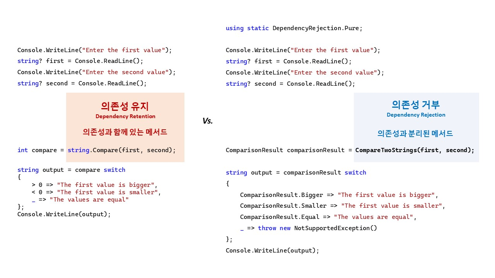

# 의존성 거부(Dependency Rejection)

## 목차
- 요구사항
- 요구사항 구현(의존성 거부, Dependency Rejection)

<br/>

## 요구사항
- 콘솔에서 문자열 2개를 입력 받는다.
- 문자열 2개를 비교한다.
- 첫 번째 문자열이 두 번째 문자열보다 크거나 작거나 같은지 콘솔에 출력한다.

<br/>

## 요구사항 구현(의존성 거부, Dependency Rejection)
> **목표**
> - 순수성: 순수 코드와 불순 코드를 분리 시킵니다.
> - 구조화: 불순 코드는 최 외각에 배치 시킵니다.
> - 테스트 자동화
>   - 순수 함수는 단위 테스트합니다.
>   - 불순 함수는 통합 테스트합니다.

### 순수 함수: 문자열 2개를 비교한다.
```cs
internal sealed class Pure
{
    public enum ComparisonResult
    {
        Bigger,
        Smaller,
        Equal
    }

    public static ComparisonResult CompareTwoStrings(string? first, string? second)
    {
        return string.Compare(first, second) switch
        {
            > 0 => ComparisonResult.Bigger,
            < 0 => ComparisonResult.Smaller,
            _ => ComparisonResult.Equal
        };
    }
}
```

### 불순 코드: 콘솔 I/O 입/출력
```cs
using static DependencyRejection.Pure;

// 불순 코드: 콘솔 입력
Console.WriteLine("Enter the first value");
string? first = Console.ReadLine();
Console.WriteLine("Enter the second value");
string? second = Console.ReadLine();

// 순수 함수
ComparisonResult comparisonResult = CompareTwoStrings(first, second);

// 불순 코드: 콘솔 출력
string output = comparisonResult switch
{
    ComparisonResult.Bigger => "The first value is bigger",
    ComparisonResult.Smaller => "The first value is smaller",
    ComparisonResult.Equal => "The values are equal",
    _ => throw new NotImplementedException()
};
Console.WriteLine(output);
```



<br/>

## 레이어 적용

<br/>

## 요구사항 테스트
### 단위 테스트: 순수 함수(요구사항 로직)

### 통합 테스트: 불순 함수(요구사항 기능)

<br/>

## 참고 자료
- [Six approaches to dependency injection](https://fsharpforfunandprofit.com/posts/dependencies/)