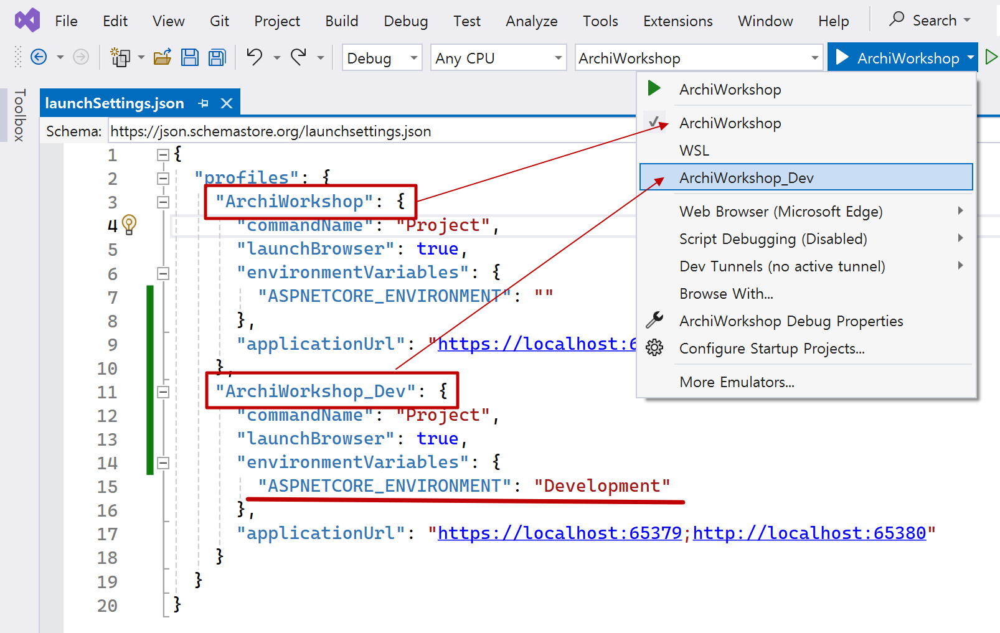

# 아키텍처 워크숍 for 도메인 주도 설계 **프로젝트**

> Architecting is all about strategically chosen concessions and trade-offs.

## 목차
- [아키텍처 구성](#아키텍처-구성)
- [Continuous Integration](#continuous-integration)
- [의존성 주입](#의존성-주입)
- [Host 프로젝트 구성](#host-프로젝트-구성)
- [Domain 프로젝트 구성](#domain-프로젝트-구성)
  - [도메인 Base 타입](#도메인-base-타입)
  - [도메인 Result 타입](#도메인-result-타입)
- [Application 프로젝트 구성](#application-프로젝트-구성)
- [패키지](#패키지)

<br/>

## 아키텍처 구성
### 레이어 구성 규칙
```
{솔루션}.{레이어}s.{주제}
```
- `{솔루션}`
- `{레이어}s`
  - Adapter
  - Application
  - Domain
- `{주제}`
  - Presentation
  - Persistence
  - Infrastructure
  - ...

### 레이어 구성 적용
```shell
ArchiWorkshop
  # Adapter Layer
  -> ArchiWorkshop.Adapters.Presentation
  -> ArchiWorkshop.Adapters.Persistence
     -> ArchiWorkshop.Adapters.Infrastructure

  # Application Layer
  -> ArchiWorkshop.Applications

  # Domain Layer
  -> ArchiWorkshop.Domains
```
- `{솔루션}` 이름은 `ArchiWorkshop`입니다.
- 도메인 레이어(`ArchiWorkshop.Domains`)는 애플리케이션 레이어만(`ArchiWorkshop.Applications`) 참조합니다.
- 어댑터 레이어 레이어에는 3개 `{주제}`가 있습니다.
  - ArchiWorkshop.Adapters.Presentation
  - ArchiWorkshop.Adapters.Persistence
  - ArchiWorkshop.Adapters.Infrastructure

### 레이어 폴더 구성

- `AssemblyReference.cs`는 어셈블리 참조를 위한 공통 파일입니다.
- `Abstractions`는 "레이어 공통 요소"와 "개별 레이어 구성"을 위한 폴더입니다.
- `{레이어명}LayerRegistration.cs`는 인터페이스 주입 등록을 위한 파일입니다.
  ```CS
  // DI 네임스페이스를 사용하여 참조와 using 구문을 제거 시킵니다.
  //namespace ArchiWorkshop.Applications.Abstractions.Registrations;
  namespace Microsoft.Extensions.DependencyInjection;

  public static class PersistenceLayerRegistration
  {
    public static IServiceCollection RegisterApplicationLayer(this IServiceCollection services)
    {
      // ...
    }
  }
  ```

<br/>

## Continuous Integration
### 폴더 구성
```
/ArchiWorkshop                                      // 솔루션 Root
    /{_N_Project_Layers}                            // 프로젝트 N개 레이어
    /TestResults                                    // 테스트 자동화 결과
        /19f5be57-f7f1-4902-a22d-ca2dcd8fdc7a       // dotnet test: 코드 커버리지 N개
            /coverage.cobertura.xml

            /merged-coverage.cobertura.xml          // dotnet-coverage: Merged 코드 커버리지

            /CodeCoverageReport                     // ReportGenerator: 코드 커버리지 Html, Badges
                /...
```

### Local CI(Build.ps1)
```shell
# 전역 도구 목록 확인하기
dotnet tool list -g

# 전역 도구 설치
dotnet tool install -g dotnet-coverage
dotnet tool install -g dotnet-reportgenerator-globaltool

# 전역 도구 업데이트
dotnet tool update -g dotnet-coverage
dotnet tool update -g dotnet-reportgenerator-globaltool

# 패키지 ID                              버전           명령
# --------------------------------------------------------------------
# dotnet-coverage                        17.9.6        dotnet-coverage
# dotnet-reportgenerator-globaltool      5.2.0         reportgenerator
```
- CI 로컬 빌드를 위해 dotnet 도구를 전역적으로 설치합니다.
  - `dotnet-coverage`
  - `dotnet-reportgenerator-globaltool`

```shell
#
# .sln 파일이 있는 곳에서 CLI 명령을 실행합니다.
#

$current_dir = Get-Location
$testResult_dir = Join-Path -Path $current_dir -ChildPath "TestResults"

# 이전 테스트 결과 정리(TestResults 폴더 정리)
if (Test-Path -Path $testResult_dir) {
  Remove-Item -Path (Join-Path -Path $testResult_dir -ChildPath "*") -Recurse -Force
}

# NuGet 패키지 복원
dotnet restore $current_dir

# 솔루션 빌드
dotnet build $current_dir --no-restore --configuration Release --verbosity m

# 솔루션 테스트
dotnet test `
  --configuration Release `
  --results-directory $testResult_dir `
  --no-build `
  --collect "XPlat Code Coverage" `
  --verbosity normal

# 코드 커버리지 머지
dotnet-coverage merge (Join-Path -Path $testResult_dir -ChildPath "**/*.cobertura.xml") `
  -f cobertura `
  -o (Join-Path -Path $testResult_dir -ChildPath "merged-coverage.cobertura.xml")

# 코드 커버리지 HTML
reportgenerator `
  -reports:(Join-Path -Path $testResult_dir -ChildPath "merged-coverage.cobertura.xml") `
  -targetdir:(Join-Path -Path $testResult_dir -ChildPath "CodeCoverageReport") `
  -reporttypes:"Html;Badges" `
  -verbosity:Info
```
```shell
# PowerShell을 관리자 권한으로 실행
Set-ExecutionPolicy RemoteSigned
```
- [Build.ps1](./Build.ps1)
- PowerShell 로컬 실행시 권한 문제가 발생하면 실행 권한을 변경합니다.

### Remote CI(GitHub Actions)
- [.github/workflows/dotnet-ci.yml](https://github.com/hhko/ArchiWorkshop/blob/main/.github/workflows/dotnet-ci.yml)


<br/>

## 의존성 주입
```
ArchiWorkshop
    -> ArchiWorkshop.Adapters.Presentation
        -> ArchiWorkshop.Application
```
- ArchiWorkshop에서 ArchiWorkshop.Application 참조 없이 ArchiWorkshop.Application 확장 메서드 사용하기

### DI 네임스페이스 변경 전
```cs
using ArchiWorkshop.Applications.Abstractions.Registrations;

var builder = WebApplication.CreateBuilder();
builder.Services.RegisterApplicationLayer();
```
- ArchiWorkshop.Applications 참조 추가
- `using ArchiWorkshop.Applications.Abstractions.Registrations;` 구문 추가

### DI 네임스페이스 변경 후(Microsoft.Extensions.DependencyInjection)
```cs
var builder = WebApplication.CreateBuilder();
builder.Services.RegisterApplicationLayer();
```
- ~~ArchiWorkshop.Applications 참조 추가~~가 불필요하다.
- ~~`using ArchiWorkshop.Applications.Abstractions.Registrations;` 구문 추가~~가 불필요하다.
- ArchiWorkshop.Host에서 ArchiWorkshop.Application의 확장 메서드를 참조와 using 구문 추가 없이 바로 사용할 수 있다.

<br/>

## Host 프로젝트 구성
### WebApi 시작 프로젝트
- 개요
  - Console 프로젝트 템플릿을 사용하여 WebApi 시작 프로젝트로 변환합니다.
- 변경 전
  ```xml
  <Project Sdk="Microsoft.NET.Sdk">
  ```
- 변경 후
  ```xml
  <Project Sdk="Microsoft.NET.Sdk.Web">
  ```
  - `Properties\launchSettings.json` 파일이 자동 생성됩니다.

### appsettings.json

- `appsettings.json`
  - Build Action: `Content`
  - Copy to Output Directory: `Copy if newer`
- `appsettings.json`, `appsettings.Development.json`
  - Visual Studio Solution Explorer: 계층 구조화

### launchSettings.json

- `profiles`: N개
  - ArchiWorkshop
  - ArchiWorkshop_Staging
  - ArchiWorkshop_Dev
  - ...
- appsettings 관계: appsettings`{.ASPNETCORE_ENVIRONMENT}`.json
  | Env.         | ASPNETCORE_ENVIRONMENT Env.                 | appsettings File                |
  |--------------|---------------------------------------------|---------------------------------|
  | Production   | `"ASPNETCORE_ENVIRONMENT": "" `             | `appsettings.json`              |
  | Staging      | `"ASPNETCORE_ENVIRONMENT": "Staging"`       | `appsettings.Staging.json`      |
  | Development  | `"ASPNETCORE_ENVIRONMENT": "Development"`   | `appsettings.Development.json`  |

  

### AspNetCore.App Framework 추가
```xml
<ItemGroup>
  <FrameworkReference Include="Microsoft.AspNetCore.App" />
</ItemGroup>
```

- `IWebHostEnvironment`

### 구조적 Serilog 구성


- 구조적 로그는 `메시지 템플릿(Message Template)`을 통해 데이터를 구조화하는 `capturing`과 데이터 출력을 결정하는 `rendering`으로 구성되어 있습니다.

#### 2단계 Serilog 초기화(Two-stage initialization)
- Bootstrap logging with Serilog + ASP.NET Core: https://nblumhardt.com/2020/10/bootstrap-logger/

```cs
// 1단계 로그 초기화: .CreateBootstrapLogger
Log.Logger = CreateSerilogLogger();

try
{
    Log.Information("Staring the host");

    var builder = WebApplication.CreateBuilder();

    // 2단계 로그 초기화: .Enrich.FromLogContext());
    builder.ConfigureSerilog();
    ...
```

```cs
public static Serilog.ILogger CreateSerilogLogger()
{
  return ...
    .WriteTo.Console()
    .CreateBootstrapLogger();
}

public static void ConfigureSerilog(this WebApplicationBuilder builder)
{
  builder.Host.UseSerilog((context, services, configuration) => configuration
    ...
    .Enrich.FromLogContext());
}
```

#### appsettings.json
```json
{
  "Serilog": {
    "Using": [
      "Serilog.Sinks.Console",
      "Serilog.Sinks.File",
      "Serilog.Exceptions"
    ],
    "WriteTo": [
      {
        "Name": "Console",
        "Args": {
          "restrictedToMinimumLevel": "Warning"   // Warning 이상 로그
        }
      },
      {
        "Name": "File",
        "Args": {
          "path": "Logs/log-.json",
          "rollingInterval": "Day",
          "formatter": "Serilog.Formatting.Json.JsonFormatter, Serilog"   // Json 로그 형식
        }
      }
    ],
    "Enrich": [
      "FromLogContext",

      // Serilog.Enrichers.Environment
      "WithMachineName",
      ...
    ]
  }
}
```

#### 로그 함수 특성화
```shell
# Logger 메서드 정의
using Microsoft.Extensions.Logging;

[LoggerMessage
(
    EventId = 1,
    EventName = $"StartingRequest in {nameof(LoggingPipeline<IRequest<IResult>, IResult>)}",
    Level = LogLevel.Information,
    Message = "Starting request {RequestName}, {DateTimeUtc}",
    SkipEnabledCheck = false
)]
public static partial void LogStartingRequest(this ILogger logger, string requestName, DateTime dateTimeUtc);

{
  "Level": "Information",                                                # Level
  "MessageTemplate": "Starting request {RequestName}, {DateTimeUtc}",    # Message
  "Properties": {
    "RequestName": "GetUserByUserNameQuery",                             # Message
    "DateTimeUtc": "2024-01-28T08:22:27.9918679Z",                       # Message
    "EventId": {
      "Id": 1,                                                           # EventId
      "Name": "StartingRequest in LoggingPipeline"                       # EventName
    }
  }
}
```
```cs
_logger.LogStartingRequest(typeof(TRequest).Name, DateTime.UtcNow);
```
- `LogInformation`와 같은 일반 로그 메서드가 아닌 특정 상황에 맞는 사용자 정의 로그 메서드를 `LoggerMessage`을 사용하여 정의할 수 있습니다.
  - [컴파일 시간 로깅 소스 생성](https://learn.microsoft.com/ko-kr/dotnet/core/extensions/logger-message-generator)
  - [.NET의 고성능 로깅](https://learn.microsoft.com/ko-kr/dotnet/core/extensions/high-performance-logging)

<br/>

## Domain 프로젝트 구성
### 폴더 구성


- `AggregateRoots`
- `{AggregateRoot 클래스}s`: AggregateRoot 단위로 폴더를 생성한다.
  - `Enumerations`: Enum 값 객체
  - `Errors`: 실패 메시지
  - `Events`: 도메인 이벤트
  - `ValueObjects`: 값 객체

### 도메인 Base 타입
- 비즈니스 이해를 통한 도메인 모델을 만들기 위한 Base 타입니다.

#### Base 타입 구성
```cs
// 1.1 ValueObject
[Serializable]
ValueObject
  : IEquatable<ValueObject>

// 1.2 Enumeration?
// TODO...

// 2.1 Entity Id
IEntityId
    : IComparable<IEntityId>
IEntityId<TEntityId>
    : IEntityId

// 2.2 Entity
IEntity
Entity<TEntityId>
    : IEquatable<Entity<TEntityId>>
    , IEntity
    where TEntityId : struct, IEntityId<TEntityId>

// 3.1 DomainEvent
IDomainEvent
    : INotification

// 3.2 AggregateRoot
IAggregateRoot
    : IEntity
AggregateRoot<TEntityId>
    : Entity<TEntityId>
    , IAggregateRoot
    where TEntityId : struct, IEntityId<TEntityId>

// 4. Auditable(Entity & AggregateRoot)
IAuditable
```
- **Value**
  - `ValueObject`
  - `Enumeration`
- **Entity**
  - `IEntityId`
  - `IEntityId<TEntityId>`
  - `IEntity`
  - `Entity<TEntityId>`
- **AggregateRoot**
  - `IDomainEvent`
  - `IAggregateRoot`
  - `AggregateRoot<TEntityId>`
- **Audit**
  - `IAuditable`

#### Base 타입 적용
```cs
// 적용 예: Entity
Customer
    : Entity<CustomerId>
    , IAuditable

// 적용 예: AggregateRoot
User
    : AggregateRoot<UserId>
    , IAuditable
```

<br/>

### 도메인 Result 타입

- 비즈니스 사용 사례(Use Case)의 성공/실패를 처리하기 위한 타입(Result, ValidationResult)입니다.

#### Result 타입 구성
- 값이 없는 성공/실패: `Result`
  ```shell
  IResult
  ↑
  Result  IValidationResult
  ↑       ↑
  ValidationResult
  ```
- 값이 있는 성공/실패: `IResult<out TValue>`
  ```shell
  IResult
  ↑
  IResult<out TValue>
  ↑
  Result<TValue>  IValidationResult
  ↑               ↑
  ValidationResult<T>
  ```

#### 유효성 결과 타입
- `ValidationResult, ValidationResult<T>`은 실패한 모든 유효성 검사 결과(ValidationErrors)를 포함 시킵니다.
- 유효성 검사 실패이기 때문에 Error 값은 `ValidationResult`입니다.
  - IsFailure: `true`
  - Error: `ValidationResult`
  - ValidationErrors: `N개`

#### Result 타입 속성
```cs
public interface IResult
{
    bool IsSuccess { get; }

    bool IsFailure { get; }

    Error Error { get; }
}

public interface IResult<out TValue> : IResult
{
    TValue Value { get; }
}

public interface IValidationResult
{
    Error[] ValidationErrors { get; }
}
```

#### Result 타입 생성
- 성공/실패를 동적으로 판단할 때
  ```cs
  // bool      : False일 때 -> ConditionNotSatisfied
  // TValue?   : NULL일 때  -> NullValue
  Create
  ```
- 성공/실패를 정적으로 판단할 때
  ```cs
  // 값이 없는 성공/실패
  Success()
  Failure(Error error)

  // 값이 있는 성공/실패
  Success<TValue>(TValue value)
  Failure<TValue>(Error error)
  ```

#### ValidationResult 타입 생성
- 성공/실패를 동적으로 판단할 때: Error 타입 컬랙션(this ICollection<Error> errors)에서 생성합니다.
  ```cs
  public static class ErrorUtilities
  {
    public static TResult CreateValidationResult<TResult>(
      this ICollection<Error> errors)
      where TResult : class, IResult

    public static ValidationResult<TValueObject> CreateValidationResult<TValueObject>(
      this ICollection<Error> errors,
      Func<TValueObject> createValueObject)
      where TValueObject : ValueObject
  }
  ```
- 성공/실패를 정적으로 판단할 때
  ```cs
  // 값이 없는 성공/실패
  WithoutErrors()
  WithErrors(Error[] validationErrors)

  // 값이 있는 성공/실패
  WithoutErrors(TValue? value)
  WithErrors(Error[] validationErrors)
  ```

#### Error 타임 구성
```cs
public string Code { get; }
public string Message { get; }
```

#### Error 타입 생성
- 사전 정의
  ```cs
  // 실패: 에러
  public static readonly Error NullValue = new($"{nameof(NullValue)}", "The result value is null.");
  public static readonly Error ConditionNotSatisfied = new($"{nameof(ConditionNotSatisfied)}", "The specified condition was not satisfied.");
  public static readonly Error ValidationError = new($"{nameof(ValidationError)}", "A validation problem occurred.");

  // 성공
   public static readonly Error None = new(string.Empty, string.Empty);
  ```
- From Exception
  ```cs
  public static Error FromException<TException>(TException exception)
    where TException : Exception
  ```
- 사용자 정의
  ```cs
  public static Error New(string code, string message)
  ```

<br/>

## Application 프로젝트 구성

### WebApi 클래스 라이브러리화
```cs
builder.Services.RegisterControllers();

WebApplication webApplication = builder.Build();

// services.AddControllers()
webApplication.MapControllers();
```
```cs
public static class ControllerRegistration
{
    public static IServiceCollection RegisterControllers(this IServiceCollection services)
    {
        services
            .AddControllers()
            .AddApplicationPart(Adapters.Presentation.AssemblyReference.Assembly);

        return services;
    }
}
```
- `AddApplicationPart` 메서드를 통해 `ControllerBase` 클래스를 구현한 WebApi 어셈블리를 추가합니다.

### ASP.NET Core Middlewares
```cs
... : IMiddleware
```

### WebApi 문서화
```cs
services.AddTransient<IConfigureOptions<SwaggerGenOptions>, OpenApiOptionsSetup>();
services.AddSwaggerGen();

app.UseSwagger();
app.UseSwaggerUI();

// AddApiExplorer 메서드에서 IApiVersionDescriptionProvider 인터페이스 구현체 DI 등록
public sealed class OpenApiOptionsSetup(IApiVersionDescriptionProvider provider)
    : IConfigureOptions<SwaggerGenOptions>
{
    // IConfigureOptions 인터페이스
    public void Configure(SwaggerGenOptions options)
    {
        foreach (var description in _provider.ApiVersionDescriptions)
        {
            options.SwaggerDoc(description.GroupName, CreateInfoForApiVersion(description));
        }
    }

    private static OpenApiInfo CreateInfoForApiVersion(ApiVersionDescription description)
    {
        var info = new OpenApiInfo()
        {
            Title = "Architecture Workshop for Domain-Driven Design",
            Version = description.ApiVersion.ToString(),
            Description = "Architecting is a series of trade-offs.",
            Contact = new OpenApiContact() { Name = "고형호", Email = "hyungho.ko@gmail.com" },
            TermsOfService = new Uri("https://github.com/hhko/ArchiWorkshop")
            //License = new OpenApiLicense() { Name = "License MIT", Url = new Uri("https://opensource.org/licenses/MIT") }
        };

        if (description.IsDeprecated)
        {
            info.Description += " This API version has been deprecated.";
        }

        return info;
    }
}
```

### WebApi 버전
```cs
public static class VersioningRegistration
{
    private const string ApiVersionHeader = "api-version";

    internal static IServiceCollection RegisterVersioning(this IServiceCollection services)
    {
        services
            .AddApiVersioning(options =>
            {
                //options.DefaultApiVersion = ApiVersion.Default;
                //options.DefaultApiVersion = new ApiVersion(2.0);
                //options.ApiVersionReader = new HeaderApiVersionReader(ApiVersionHeader);

                // "api-version" required 제거
                options.AssumeDefaultVersionWhenUnspecified = true;

                // Response headers
                //    api-deprecated-versions: 1.0                      <- ReportApiVersions = true;
                //    api-supported-versions: 2.0
                //
                //    content-type: application/json; charset=utf-8
                //    date: Fri,02 Feb 2024 14:57:46 GMT
                //    server: Kestrel
                //    transfer-encoding: chunked
                options.ReportApiVersions = true;
            })
            .AddApiExplorer(options =>      // IApiVersionDescriptionProvider 구현체 DI 등록
            {
                // https://github.com/dotnet/aspnet-api-versioning/wiki/Version-Format#custom-api-version-format-strings
                // "'v'major[.minor][-status]"
                options.GroupNameFormat = "'v'VVV";

                // 버전 URL 포함
                // [ApiVersion(2.0)]
                // [Route("api/v{version:apiVersion}/[controller]")]
                // public class UsersController : ControllerBase
                //
                // 적용 예
                //    api/v2/users
                options.SubstituteApiVersionInUrl = true;
            });

        return services;
    }
}
```

### CQRS 인터페이스
```cs
// 요청: IRequest
// 요청 결과: IResult<TResponse>
// 요청 결과 조건: where TResponse : IResponse
public interface IQuery<out TResponse> : IRequest<IResult<TResponse>>
    where TResponse : IResponse
{
}
```


<br/>

## 패키지
```shell
#
# 레이어
#

# 도메인
- Ulid
- MediatR.Contracts

# 애플리케이션

# 어댑터: Presentation
- MediatR                           # Adapter <--중제자--> Application
- Microsoft.AspNetCore.App          # 프레임워크
- Asp.Versioning.Mvc.ApiExplorer    # WebApi 버전
- Swashbuckle.AspNetCore            # WebApi 문서화
- Swashbuckle.AspNetCore.Filters

# 호스트
- Serilog.AspNetCore
  - Serilog.Settings.Configuration
  - Serilog.Sinks.Console
  - Serilog.Sinks.Debug
  - Serilog.Sinks.File
- Serilog.Enrichers.Environment
- Serilog.Enrichers.Process
- Serilog.Enrichers.Thread
- Serilog.Exceptions
- SerilogTimings
- ~~Destructurama.Attributed~~

#
# 테스트
#

# 테스트
- Microsoft.NET.Test.Sdk
- xunit
- FluentAssertions

# 테스트 아키텍처
- NetArchTest.Rules

# 테스트 데이터
- Bogus
```

<br/>

## 로그 출력 예
```
[01:34:41 INF] Starting request GetUserByUserNameQuery, 01/28/2024 16:34:41
[01:34:51 INF] Request completed GetUserByUserNameQuery, 01/28/2024 16:34:51
```

```json
{
    "Timestamp": "2024-01-28T17:22:27.9955867+09:00",
    "Level": "Information",
    "MessageTemplate": "Starting request {RequestName}, {DateTimeUtc}",
    "TraceId": "8a524c53c007f0ece499959328d59b85",
    "SpanId": "a9a2de05e40a93ed",
    "Properties": {
        "RequestName": "GetUserByUserNameQuery",
        "DateTimeUtc": "2024-01-28T08:22:27.9918679Z",
        "EventId": {
            "Id": 1,
            "Name": "StartingRequest in LoggingPipeline"
        },
        "SourceContext": "ArchiWorkshop.Applications.Abstractions.Pipelines.LoggingPipeline",
        "ActionId": "0602c599-3f0d-48be-a088-aceada16f4fa",
        "ActionName": "ArchiWorkshop.Adapters.Presentation.Controllers.UsersController.GetUserByUsername (ArchiWorkshop.Adapters.Presentation)",
        "RequestId": "0HN0VR8NTVHVD:00000001",
        "RequestPath": "/api/users/foo",
        "ConnectionId": "0HN0VR8NTVHVD",
        "MachineName": "HHKO-LABTOP",
        "EnvironmentUserName": "HHKO-LABTOP\\고형호",
        "EnvironmentName": "Production",
        "ProcessId": 34360,
        "ProcessName": "ArchiWorkshop",
        "ThreadId": 12,
        "ThreadName": ".NET TP Worker"
    }
}
{
    "Timestamp": "2024-01-28T17:22:28.0179135+09:00",
    "Level": "Information",
    "MessageTemplate": "Request completed {requestName}, {DateTimeUtc}",
    "TraceId": "8a524c53c007f0ece499959328d59b85",
    "SpanId": "a9a2de05e40a93ed",
    "Properties": {
        "requestName": "GetUserByUserNameQuery",
        "DateTimeUtc": "2024-01-28T08:22:28.0174334Z",
        "EventId": {
            "Id": 2,
            "Name": "CompletingRequest in LoggingPipeline"
        },
        "SourceContext": "ArchiWorkshop.Applications.Abstractions.Pipelines.LoggingPipeline",
        "ActionId": "0602c599-3f0d-48be-a088-aceada16f4fa",
        "ActionName": "ArchiWorkshop.Adapters.Presentation.Controllers.UsersController.GetUserByUsername (ArchiWorkshop.Adapters.Presentation)",
        "RequestId": "0HN0VR8NTVHVD:00000001",
        "RequestPath": "/api/users/foo",
        "ConnectionId": "0HN0VR8NTVHVD",
        "MachineName": "HHKO-LABTOP",
        "EnvironmentUserName": "HHKO-LABTOP\\고형호",
        "EnvironmentName": "Production",
        "ProcessId": 34360,
        "ProcessName": "ArchiWorkshop",
        "ThreadId": 12,
        "ThreadName": ".NET TP Worker"
    }
}
```

application/problem+json
```
{
  "type": "Exception",
  "title": "ExceptionOccurred",
  "status": 500,
  "detail": "The value of a failure result can not be accessed. Type 'ArchiWorkshop.Applications.Features.Users.Queries.UserResponse'.",
  "instance": "/api/users/1234567890123456789012345678901",
  "errors": null,
  "RequestId": "0HN11QHRCG29J:00000001"
}
```

```
{
  "type": "ValidationError",
  "title": "ValidationError",
  "status": 400,
  "detail": "A validation problem occurred.",
  "errors": [
    {
      "code": "UserName.TooLong",
      "message": "UserName name must be at most 30 characters."
    }
  ]
}
```

```
{
    "Timestamp": "2024-01-31T05:57:36.3127551+09:00",
    "Level": "Error",
    "MessageTemplate": "Request [{Method}] at {Path} thrown an exception '{Name}' from source '{Source}'. \n Exception message: '{Message}'. \n StackTrace: '{StackTrace}'",
    "TraceId": "4b08cb8372ab5e20f82dda0450fa6bdf",
    "SpanId": "85b035af0a365183",
    "Properties": {
        "Method": "GET",
        "Path": "/api/users/throw",
        "Name": "Exception",
        "Source": "ArchiWorkshop.Applications",
        "Message": "Hi",
        "StackTrace": "   at ArchiWorkshop.Applications.Features.Users.Queries.GetUserByUserNameQueryHandler.Handle(GetUserByUserNameQuery query, CancellationToken cancellationToken) in C:\\Workspace\\Github\\ArchiWorkshop\\Projects\\ArchiWorkshop\\Src\\ArchiWorkshop.Applications\\Features\\Users\\Queries\\GetUserByUserNameQueryHandler.cs:line 35\r\n   at ArchiWorkshop.Applications.Abstractions.Pipelines.FluentValidationPipeline`2.Handle(TRequest request, RequestHandlerDelegate`1 next, CancellationToken cancellationToken) in C:\\Workspace\\Github\\ArchiWorkshop\\Projects\\ArchiWorkshop\\Src\\ArchiWorkshop.Applications\\Abstractions\\Pipelines\\FluentValidationPipeline.cs:line 49\r\n   at ArchiWorkshop.Applications.Abstractions.Pipelines.LoggingPipeline`2.Handle(TRequest request, RequestHandlerDelegate`1 next, CancellationToken cancellationToken) in C:\\Workspace\\Github\\ArchiWorkshop\\Projects\\ArchiWorkshop\\Src\\ArchiWorkshop.Applications\\Abstractions\\Pipelines\\LoggingPipeline.cs:line 28\r\n   at ArchiWorkshop.Adapters.Presentation.Controllers.UsersController.GetUserByUserName(String userName, CancellationToken cancellationToken) in C:\\Workspace\\Github\\ArchiWorkshop\\Projects\\ArchiWorkshop\\Src\\ArchiWorkshop.Adapters.Presentation\\Controllers\\UsersController.cs:line 24\r\n   at Microsoft.AspNetCore.Mvc.Infrastructure.ActionMethodExecutor.TaskOfIActionResultExecutor.Execute(ActionContext actionContext, IActionResultTypeMapper mapper, ObjectMethodExecutor executor, Object controller, Object[] arguments)\r\n   at Microsoft.AspNetCore.Mvc.Infrastructure.ControllerActionInvoker.<InvokeActionMethodAsync>g__Awaited|12_0(ControllerActionInvoker invoker, ValueTask`1 actionResultValueTask)\r\n   at Microsoft.AspNetCore.Mvc.Infrastructure.ControllerActionInvoker.<InvokeNextActionFilterAsync>g__Awaited|10_0(ControllerActionInvoker invoker, Task lastTask, State next, Scope scope, Object state, Boolean isCompleted)\r\n   at Microsoft.AspNetCore.Mvc.Infrastructure.ControllerActionInvoker.Rethrow(ActionExecutedContextSealed context)\r\n   at Microsoft.AspNetCore.Mvc.Infrastructure.ControllerActionInvoker.Next(State& next, Scope& scope, Object& state, Boolean& isCompleted)\r\n   at Microsoft.AspNetCore.Mvc.Infrastructure.ControllerActionInvoker.InvokeInnerFilterAsync()\r\n--- End of stack trace from previous location ---\r\n   at Microsoft.AspNetCore.Mvc.Infrastructure.ResourceInvoker.<InvokeFilterPipelineAsync>g__Awaited|20_0(ResourceInvoker invoker, Task lastTask, State next, Scope scope, Object state, Boolean isCompleted)\r\n   at Microsoft.AspNetCore.Mvc.Infrastructure.ResourceInvoker.<InvokeAsync>g__Awaited|17_0(ResourceInvoker invoker, Task task, IDisposable scope)\r\n   at Microsoft.AspNetCore.Mvc.Infrastructure.ResourceInvoker.<InvokeAsync>g__Awaited|17_0(ResourceInvoker invoker, Task task, IDisposable scope)\r\n   at ArchiWorkshop.Applications.Abstractions.Middlewares.RequestTimeMiddleware.InvokeAsync(HttpContext context, RequestDelegate next) in C:\\Workspace\\Github\\ArchiWorkshop\\Projects\\ArchiWorkshop\\Src\\ArchiWorkshop.Applications\\Abstractions\\Middlewares\\RequestTimeMiddleware.cs:line 15\r\n   at Microsoft.AspNetCore.Builder.UseMiddlewareExtensions.InterfaceMiddlewareBinder.<>c__DisplayClass2_0.<<CreateMiddleware>b__0>d.MoveNext()\r\n--- End of stack trace from previous location ---\r\n   at ArchiWorkshop.Applications.Abstractions.Middlewares.ErrorHandlingMiddleware.InvokeAsync(HttpContext context, RequestDelegate next) in C:\\Workspace\\Github\\ArchiWorkshop\\Projects\\ArchiWorkshop\\Src\\ArchiWorkshop.Applications\\Abstractions\\Middlewares\\ErrorHandlingMiddleware.cs:line 20",
        "EventId": {
            "Id": 10,
            "Name": "ErrorHandlingMiddleware"
        },
        "SourceContext": "ArchiWorkshop.Applications.Abstractions.Middlewares.ErrorHandlingMiddleware",
        "RequestId": "0HN11QNBH4BDB:00000001",
        "RequestPath": "/api/users/throw",
        "ConnectionId": "0HN11QNBH4BDB",
        "MachineName": "HHKO-LABTOP",
        "EnvironmentUserName": "HHKO-LABTOP\\고형호",
        "EnvironmentName": "Production",
        "ProcessId": 15164,
        "ProcessName": "ArchiWorkshop",
        "ThreadId": 17,
        "ThreadName": ".NET TP Worker"
    }
}
```